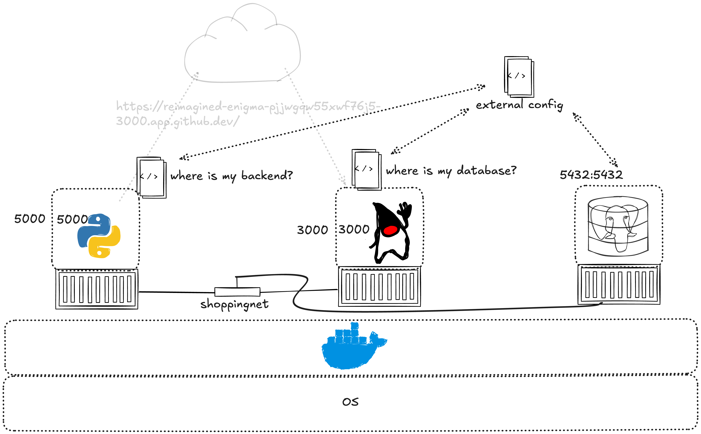

# Labs

## Team size
up to 2 persons

## **Lab Instructions: Distributed Application Development**

In this lab, you will design and implement either a frontend or backend application using your chosen framework, adhering to core principles of distributed systems and cloud-native development. Follow the instructions carefully, ensuring proper external configuration and applying the 12-factor methodology.

Put your names, repos and technologies into the spreadsheet. Don't reuse technologies already listed.

### **General Requirements**

1. **Application Setup**
   - Choose a framework (frontend or backend) for your application.
   - Implement the provided `REST_API.json` specifications from either a client or server perspective.

2. **Configuration and 12-Factor Compliance**
   - **Externalized Configuration**: Ensure all configurations are externalized—no hardcoded ports, URLs, or connection properties.
   - **12-Factor Principles**: Apply 12-factor app methodology, and document your approach for each factor applied.
   - **Documentation**: Comment your code and write a short summary explaining how you applied the 12-factor principles.

3. **Containerization**
   - **Docker**: Write Dockerfiles to containerize your application.
   - **Docker Compose**: Set up a `docker-compose.yml` file to define and run multi-container Docker applications.
   - **Kubernetes**: After Docker, create Kubernetes manifests (deployment files) for deploying your application in a Kubernetes environment.

### **Server-Side/Backend Instructions**

1. **CORS Settings**  
   - Configure CORS to allow requests from all origins (note: this approach is temporary and potentially insecure in production environments).

2. **Framework Selection**  
   - Select a backend framework **other than Spring Boot** (consider using other JVM frameworks like Micronaut or Quarkus) and **Express.js**.

3. **Documentation and Status Codes**
   - Implement in-code documentation using Swagger or a similar API documentation tool.
   - Make sure to handle appropriate HTTP status codes in your responses.

4. **Database Configuration**  
   - **Skip Database Configuration**: Database setup will be covered in the following lab, so you do not need to implement it here.

### **Client-Side/Frontend Instructions**

1. **Framework Selection**  
   - Use a framework **other than Python Flask** that supports server-side rendering (SSR) for easier configuration and adaptability in distributed systems.

2. **External Communication**  
   - Ensure that the client application can communicate with the backend on a non-localhost network to simulate real-world deployment.

3. **Status Code Handling**  
   - Incorporate status code handling in your client code to ensure appropriate responses to successful and unsuccessful requests.

---

### **Submission Checklist**

0. Everything in an own git repo / Link in Spreadsheet. Repo must be public.
1. Application code implementing `REST_API.json` specifications.
2. Dockerfile(s) and `docker-compose.yml`.
3. Short documentation on 12-factor principle application.
4. If applicable, Kubernetes manifest files.
5. Code documentation (comments and/or README).
   a. Provide instructions how to build, containerize and test app

---
