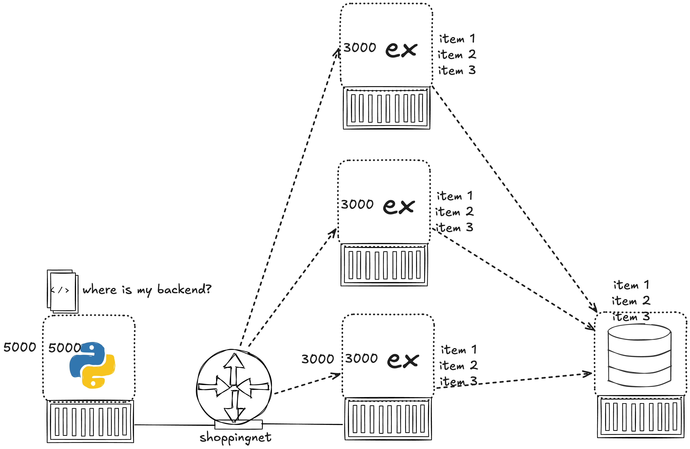
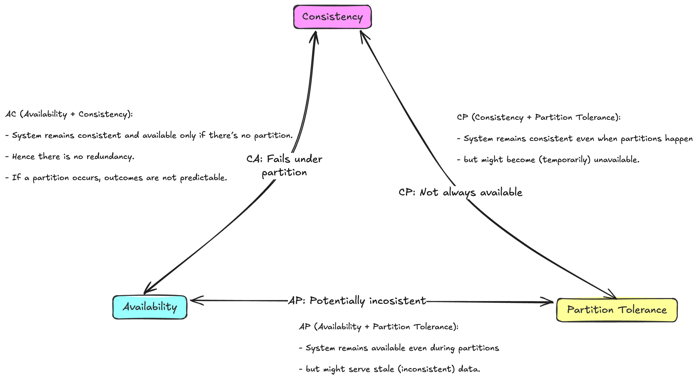
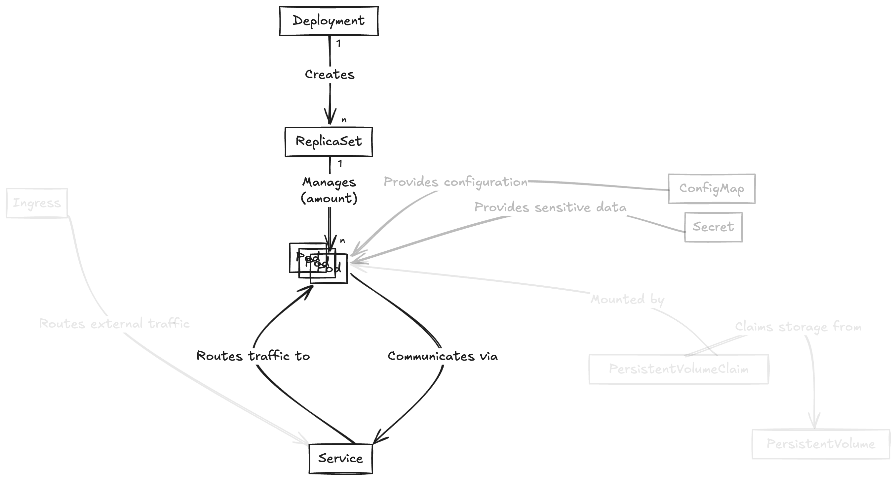
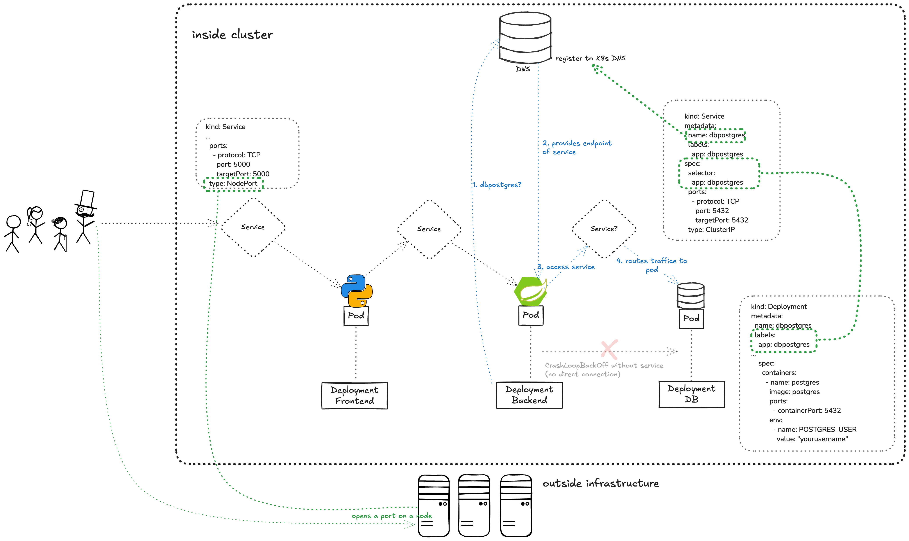
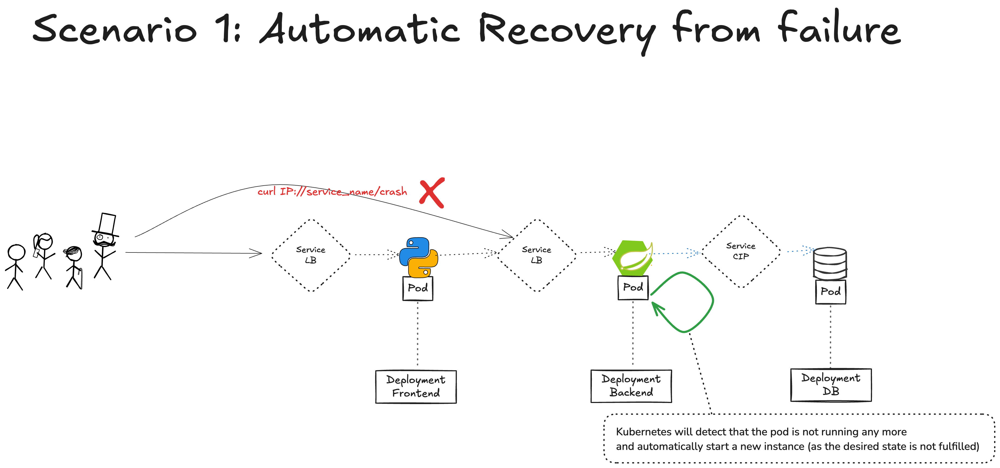
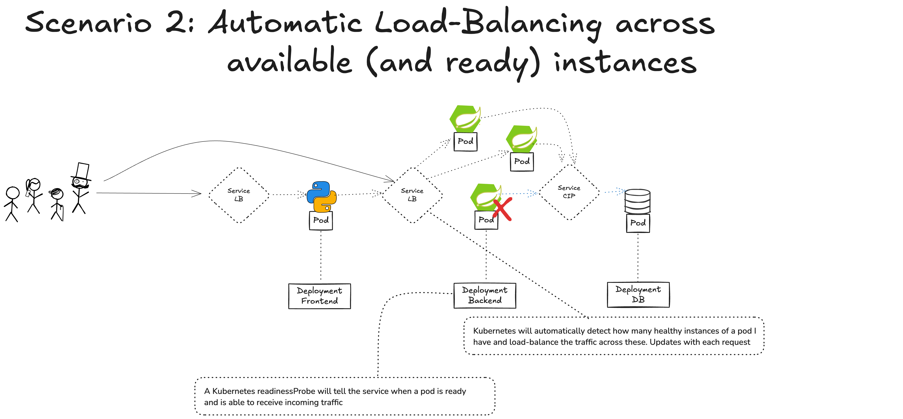
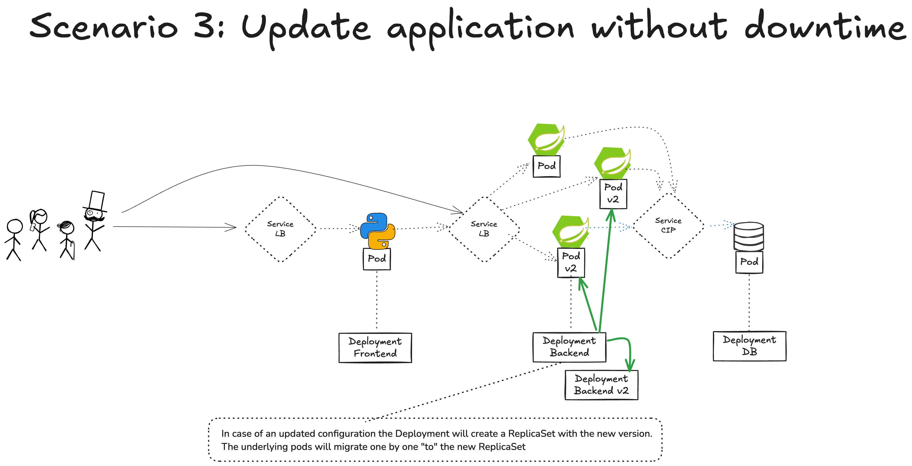

# hse-25-summer

## 2025-03-17 Initial session - Distributed Systems & Cloud Introduction

### **Content Overview**

1. **Distributed Systems**
   - Difference distributed and non-distributed systems
   - Reasons to use/implement distributed-systems
   - Categories of heterogenity and resilience
   - Role communication protocols, service registry, distributed configuration
   - The fallacies of distributed computing

2. **The NIST Cloud Definition (2011)**
   - Breakdown of the NIST’s five essential cloud characteristics, deployment models, and service models. 

3. **Cloud Service/Abstraction Models**
   - IaaS, PaaS, SaaS revisited, with modern examples.
   - The evolution of abstraction models, including FaaS and Containers-as-a-Service (CaaS).

4. **Introduction to CNCF**
   - Role of the Cloud Native Computing Foundation (CNCF) in the cloud ecosystem.
   - CNCF Landscape: technologies, tools, and projects.

---

### **Learning Objectives**
By the end of this lecture, students will be able to:
- Distinguish between distributed and non-distributed systems
- Explain the importance of heterogeneity and resilience as key drivers for distributed systems.
- Describe the NIST cloud definition and its significance in the modern cloud landscape.
- Identify the major cloud providers and tell about their evolution.
- Differentiate between cloud service models and discuss their evolution, including modern abstraction models like CaaS.

### **Student/Review Questions**
- What are the five essential characteristics of cloud computing according to NIST, and how do they apply to modern cloud services?
- Identify 3 main cloud providers and list their most important services
- What are the differences between IaaS, PaaS, and SaaS? Give examples of each in today's cloud ecosystem.
- What is the CNCF, and why is it important in the context of cloud-native technologies?
- Describe 3 of the fallacies of distributed computing

---

### **Suggested Reading & Resources**
- [NIST 2011 Cloud Computing Definition](https://nvlpubs.nist.gov/nistpubs/Legacy/SP/nistspecialpublication800-145.pdf)
- CNCF [Cloud Native Landscape](https://landscape.cncf.io/)

## **2025 / 03 / 24 - Recap Distributed Systems & Cloud**  

### **Content Overview**
1. **The NIST Cloud Definition (2011)** 
2. **Overview of Major Cloud Providers**
   - Key players in the cloud space (AWS, Azure, Google Cloud, etc.).
   - Comparing evolution.

3. **Cloud Service/Abstraction Models**
4. **Introduction to CNCF**
   - Role of the Cloud Native Computing Foundation (CNCF) in the cloud ecosystem.
   - CNCF Landscape: technologies, tools, and projects.

5. **Popular CNCF Technologies**
   - **Kubernetes**: Container orchestration in cloud-native environments.
   - **eBPF**: Extending kernel capabilities for monitoring and security.
   - **OpenTelemetry**: Observability standards and practices in modern cloud systems.

---

## **2025 / 03 / 24 - Cloud-based IDEs**

### **Content Overview**

1. **Overview of Cloud-Based IDEs**
   - Introduction to cloud-based integrated development environments (IDEs).
   - **GitHub Codespaces**: Full development environments in the cloud.
   - **Google IDX**: Automating and provisioning cloud-based workspaces for development.
   - Benefits of cloud-based IDEs for distributed systems development.

---

### **Learning Objectives**
By the end of this lecture, students will be able to:

- Explain the advantages of using cloud-based IDEs, such as GitHub Codespaces and IDX, for distributed system development.
- Demonstrate an understanding of how these tools enhance collaboration and scalability in cloud-native environments.

---

### **Student/Review Questions**
1. Analyze GitHub Codespaces and IDX. What are the key features that make them suitable for developing distributed systems?
2. What are the main benefits of using cloud-based IDEs compared to traditional, local development environments?

---

### **Suggested Reading & Resources**
- [GitHub Codespaces Documentation](https://github.com/features/codespaces)
- [IDX Website](https://idx.dev/)

---

## **2025 / 03 / 31 - Distributed Systems & Cloud-native Theory**

### **Content Overview**  

This lecture focused on the theoretical foundations of **cloud-native software design**, revisiting core motivations for distributed systems. The discussion was structured around two main drivers:  
- **Heterogeneity**: leveraging diverse platforms, operating systems, and languages in one system.  
- **Resilience**: enabling scalability, fault-tolerance, load balancing, and modern deployment strategies like blue-green deployments.

Students also reviewed the **technical requirements** for distributed system architecture, including network communication, service discovery, distributed configuration, and observability. The main part of the lecture introduced the **12-Factor App methodology** as a widely adopted guideline for building robust, maintainable, and portable distributed applications.

---  
### **Learning Objectives**  

By the end of this lecture, students will be able to:  
1. Explain key motivations behind building distributed systems, focusing on heterogeneity and resilience.  
2. Identify the foundational technical needs of distributed architectures.  
3. Understand and describe the purpose and impact of the 12 factors in the 12-Factor App methodology.  
4. Apply the 12-Factor principles as guidelines for designing and building cloud-native applications.

---  
### **Student/Review Questions**  

1. What are typical reasons for building distributed systems instead of monolithic applications?  
2. How do distributed systems enable heterogeneity in software development?  
3. What infrastructure and platform features are required to support distributed systems?  
4. Name and explain at least four principles from the 12-Factor App methodology and how they relate to distributed system needs.  
5. Why is configuration management especially important in a distributed environment?  
6. How do deployment practices like blue-green deployments contribute to system resilience?  

## **2025 / 04 / 07 - Containers & Docker**

### Content Overview

1. Development in distributed teams withouth containers and the potential problems:
   - Polyglot application landscapes are challenging as all work environments need to match all runtime requirements for all languages
   - Transporting application from environment A to environment B introduces challenges and problems with mismatching runtimes

2. **Containers**
   - Isolate Applications from each other
   - Package Applications along with all Runtime requirements for easy execution and transportation between working environments
   - Simplify configuration of working environments -> only container engine needed
   - handling of all application containers through same mechanisms: docker build, docker run

3. **Docker**
   - Docker ecosystem consists of the Docker Daemon, Docker CLI and Docker Hub
   - Creation of Dockerfiles
   - Building Images - Understanding the layer concept in container images
   - Running Containers
   - Running multiple container apps with Docker Compose

### **Student/Review Questions**
1. What is Docker, and how does it differ from traditional virtual machines?
2. Explain the concept of a Docker image and a Docker container. How are they related?
3. What are the main components of a Dockerfile? Describe the purpose of each component.
4. How does Docker ensure isolation and security between containers?
5. What is a container registry, and how do you use Docker Hub to share or deploy images?
6. Describe the process of building and running a containerized application using Docker, including common commands.
7. In which way does Docker Compose use existing fuctionality and in which way does it extend it?.

### Homework
- Get a Docker account
- Add Containerization to your Lab project

## **2025 / 04 / 14 - CAP Theorem, scalability, state, persistence**

---

### **Content Overview**

This lecture explored the theoretical and practical aspects of **data persistence** and **scalability** in distributed systems.  
We revisited the **CAP Theorem** to understand the trade-offs between consistency, availability, and partition tolerance. Students compared **scale-up** (vertical scaling) vs. **scale-out** (horizontal scaling) strategies.  
The differences between **in-memory persistence** and **real database persistence** were illustrated through examples using **Spring Data JPA** with **H2 (in-memory)** and **PostgreSQL (external database)**.

---

### **Learning Objectives**

By the end of this lecture, students will be able to:  
1. Explain the CAP Theorem and the implications for distributed system design.  
2. Differentiate between scale-up and scale-out approaches and recognize their trade-offs.  
3. Compare in-memory persistence with external database persistence in terms of simplicity, performance, and scalability.  
4. Why did the CAP theorem become so relevant in the last decade even though it already exists since 1990?

---

### **Student/Review Questions**

1. What does the CAP Theorem state, and why is it relevant for distributed systems?  
2. What are the key differences between scaling up and scaling out? Provide examples of each.  
3. What are the pros and cons of using an in-memory database like H2 compared to a full external database like PostgreSQL?  
4. How does Spring Data JPA help simplify database interactions in a Java application?  
5. Why might an application start with in-memory persistence during development but move to an external database later?

---

## **2025 / 04 / 28 - Onsite Lab Session**

## **2025 / 05 / 05 - API and REST & Distributed Application Development**

### **Content Overview**

1. **API and REST**  
   - **HTTP Basics**: Core concepts of HTTP for APIs, including request/response structure.  
   - **Introduction to REST**: Understanding the foundational ideas of REST as defined by Roy Fielding and how RESTful APIs communicate.  
   - **Nouns and Verbs**: Structuring REST APIs around resources (nouns) and actions (verbs).  
   - **Representation**: Data formats in REST (e.g., JSON, XML) and the role of content negotiation.  
   - **HTTP Return Codes**: Standard HTTP status codes, their meanings, and when to use each in API responses.  
   - **Idempotency**: Ensuring repeatable requests yield the same results to prevent unintended side effects.  
   - **Richardson's Maturity Model**: Levels of RESTful maturity, from Level 0 (HTTP as a tunnel) to Level 3 (HATEOAS), to understand API design progression.  
   - **OpenAPI and Swagger**: Using OpenAPI for defining APIs, ensuring consistency, and employing Swagger UI for visualization and testing.

2. **Docker-Compose for Multi-Component Applications**  
   - Setting up multi-component applications using Docker Compose, integrating backend APIs, databases, and frontends in a single `docker-compose.yml` file.  
   - Configuration of service communication, externalized settings, and container networking to simplify deployment and scaling.
   - Usage of Traefik as "smart router" and load-balancer.

---

### **Objectives and Exercises**

*Students should be able to:*

- Describe the foundational principles of REST and explain the HTTP concepts that underpin REST APIs.  
- Use OpenAPI to define REST APIs and visualize them with Swagger UI.  
- Create and configure a Docker Compose file to integrate multiple application components and enable effective communication between services.  

---

### **Student/Review Questions**

1. **What are the core principles of REST, and how do they align with HTTP concepts?**  
2. **Explain the importance of structuring REST APIs around resources (nouns) and actions (verbs). Provide examples.**  
3. **What is Richardson’s Maturity Model, and how does it help assess the maturity of a REST API?**  
4. **Why is idempotency important in REST APIs? Give an example of an idempotent and a non-idempotent HTTP method.**  
5. **Describe the advantages of using OpenAPI for REST API documentation.**  
6. **How does Docker Compose enable multi-component application setups, and what are the benefits of externalized configuration?**  
7. **Explain the role of container networking in Docker Compose and how it facilitates service communication.**

---

## **HOMEWORK!!**

- Watch the recordings from the previous session - priority on cloud-native theory!

### **Suggested Reading & Resources**

- [Roy Fielding’s REST Dissertation](https://www.ics.uci.edu/~fielding/pubs/dissertation/rest_arch_style.htm)
- [HTTP Status Codes](https://developer.mozilla.org/en-US/docs/Web/HTTP/Status)
- [Richardson's Maturity Model](https://martinfowler.com/articles/richardsonMaturityModel.html)

## **2025 / 05 / 12 - Introduction to Kubernetes and practical demo**

### Content Overview

In the theoretical overview, we explored the architecture and core concepts of Kubernetes, focusing on its role in automating deployment, scaling, and management of containerized applications. Key elements such as the control plane, nodes, pods, deployments and services were discussed in relation to how Kubernetes maintains desired state and ensures high availability.

1. Kubernetes Basics: Overview of Kubernetes as a container orchestration platform, its control plane and worker node architecture.
2. Pods: Understanding the smallest deployable units in Kubernetes and their lifecycle.
3. Deployments: Declarative management of pod replicas, rolling updates, and self-healing mechanisms.
4. Services: Abstracting access to pods through stable network endpoints (ClusterIP, NodePort, LoadBalancer).

The second session focused on hands-on experience through a live demonstration. Students learned how to define and deploy applications using Kubernetes manifests, written in YAML. We created and explored the behavior of Pods, Deployments, and Services, highlighting their roles in workload management, scaling, and exposing applications.
Using kubectl, we interacted directly with the cluster—applying manifests, inspecting resources, viewing logs, and debugging running containers.

- Creating Kubernetes Manifests - YAML Syntax and Structure: Crafting Kubernetes resource definitions in YAML.
- Interacting with the Cluster using kubectl
- Resource Management: Creating, updating, and deleting resources using kubectl apply, kubectl delete, and kubectl get.
- Inspection and Debugging: Using kubectl describe, kubectl logs, and kubectl exec to understand application and cluster state.

### Objectives and Exercises
Students should be able to:
- Understand the role and structure of core Kubernetes objects like Pods, Deployments, and Services.
- Write valid Kubernetes manifests in YAML and apply them to a cluster.
- Use kubectl to create, inspect, and manage resources in a Kubernetes environment.
- Expose applications using Services and debug issues using common kubectl commands.

### Student / Review Questions
- What is a Kubernetes Pod, and how does it differ from a container?
- Explain the purpose of a Deployment in Kubernetes. How does it help manage application availability?
- What are the differences between the Service types: ClusterIP, NodePort, and LoadBalancer?
- How does kubectl apply differ from kubectl run or kubectl create, and when should you use each?
- What are labels and selectors used for in Kubernetes manifests?
- How can you inspect the logs of a container running in a Pod?
- Why is YAML used for Kubernetes configuration, and what are some common pitfalls to avoid?

## **2025 / 05 / 19 - Kubernetes and practical demo**

### Recap and relationship of important API objects

### Defining a multi-application Kubernetes configuration - making things run and communicate

### **Content Overview**  

This lecture provides an introduction to Kubernetes deployment options and revisits essential Kubernetes API objects in greater detail. Students will explore free Kubernetes trials offered by major cloud providers, local deployment tools like Minikube and Kind, and how to use Kubernetes in cloud-based IDEs like GitHub Codespaces. The session also deepens understanding of fundamental API objects such as Pods, Deployments, and Services, equipping students with practical knowledge for managing containerized applications in Kubernetes.  

---

### **Learning Objectives**  

By the end of this lecture, students will be able to:  

1. Set up a Kubernetes cluster locally using tools like Minikube or Kind, and within GitHub Codespaces.  
2. Describe the roles and relationships of basic Kubernetes API objects, including Pods, Deployments, and Services.  
3. Deploy and manage containerized applications using Kubernetes API objects.  

---  

### **Student/Review Questions**  

1. What are the advantages and limitations of using Kubernetes free trials from cloud providers compared to local tools like Minikube?  
2. How does Minikube enable Kubernetes functionality within a GitHub Codespaces environment?  
3. What is the role of a Pod in Kubernetes, and how does it differ from a Deployment?  
4. How do Services enable communication between Kubernetes Pods and external clients?  
5. How can you use a Deployment to ensure high availability for an application in Kubernetes? 

## **2024-12-20 Kubernetes Behaviour & Networking**

### **Content Overview**  

In this final Kubernetes lecture, wd explored key concepts to manage and scale applications effectively. The lecture covered the three main Kubernetes Service types—ClusterIP, NodePort, and LoadBalancer—and their use cases. Students also learned how to scale instances in a Deployment, achieving automatic load-balancing across Pods using a ClusterIP Service. The session demonstrated how Kubernetes handles automatic updates of applications through rolling updates in Deployments and how it ensures high availability by automatically recovering failed instances.  

---  
### **Learning Objectives**  

By the end of this lecture, students will be able to:  
1. Differentiate between the three main Kubernetes Service types: ClusterIP, NodePort, and LoadBalancer.  
2. Scale a Kubernetes Deployment to handle increased load and distribute traffic automatically across instances.  
3. Implement rolling updates in a Deployment to update applications without downtime.  
4. Explain how Kubernetes ensures application stability by automatically recovering from Pod failures.  

---  
### **Student/Review Questions**  

1. What are the differences between ClusterIP, NodePort, and LoadBalancer Services in Kubernetes?  
2. How does Kubernetes automatically distribute incoming traffic across multiple instances in a Deployment?  
3. How can you scale a Deployment to add more instances of your application?  
4. What is a rolling update in Kubernetes, and why is it important for managing application updates?  
5. How does Kubernetes detect and recover from crashed or failed Pods automatically?  
6. Why is load-balancing critical in distributed systems, and how does Kubernetes achieve this with Services?  

